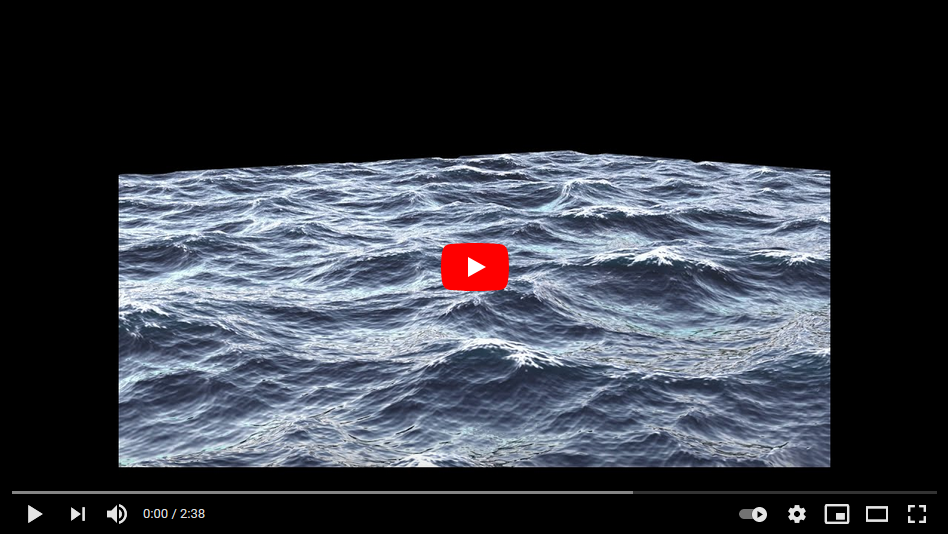

# fea_osl
OSL shaders

## SimpleOcean

SimpleOcean is a Gerstner Wave implementation to simulate ocean vector displacement. It isn't highly complex, but should do the job when you need a quick & dirty ocean. The shader outputs a main vector displacement map and multiple utility maps, like foam maps, above sea map, etc.

Connect the main output to Arnold Properties Vector Displacement map input.

### Known Issues
- **Animation doesn't work!** There is currently a bug with the Arnold Properties Displacement map input. Once that is fixed I can test animation.
- When using very large maps, the ocean generation can be slow.

### Getting Started
The following should create a decently shaded ocean. For best results use and HDRI environment.

#### Arnold Properties
- Displacement > Enable
- Displacement > Bounds pads : 1.0
- Displacement > Use Map
- Connect Displacement output to that map.

Optional, Auto-Bump replaces subdiv and is much faster.
- Subdivision > Catclark
- Subdivision > Iterations : about 2-3

#### Arnold Standard Surface Setup
- Diffuse : 0
- IOR : 1.33
- Specular : ~1
- Transmission : 1
- Transmission Color : ~blue
- Transmission Depth : 0.1+
- Scatter : White (or other color)
- Scatter Anisotropy : 1
