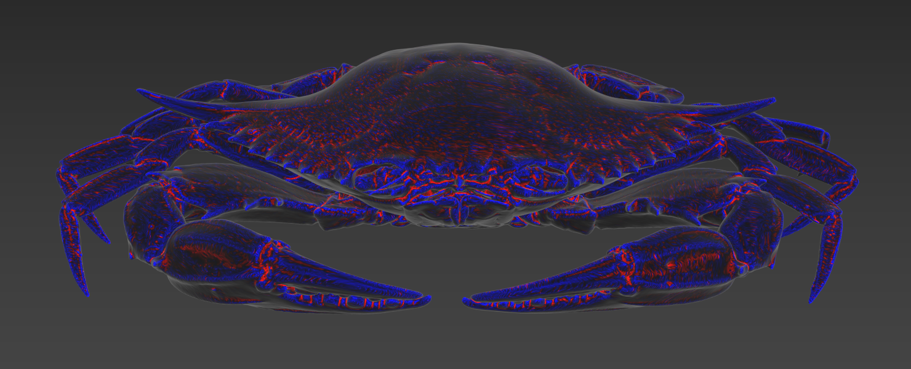
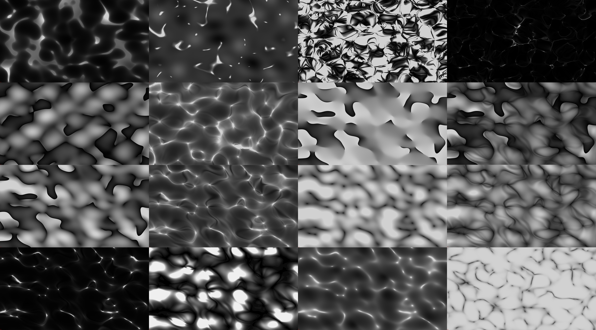
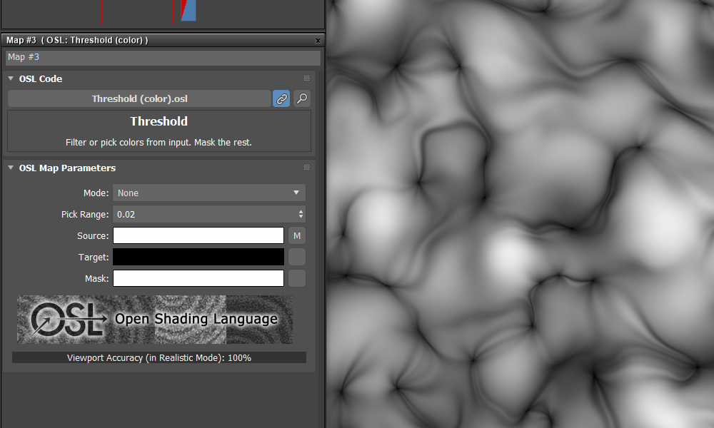

# fea_osl
3ds Max OSL shaders

## Shader Installation
- Download the [latest release](https://github.com/p-groarke/fea_osl/releases/latest) and unzip.
- In 3dsMax, add a user plugin folder (Customize > Configure User and System Paths > 3rd Party Plug-Ins).
- Add an `OSL` folder in that plugin folder.
- Copy the `FeaOSL` folder to your new `OSL` directory.
- You should see the shaders in your material editor drop-down on next 3dsMax launch.

## Curvalicious
Curvalicious is a fast (no raytracing) screen-space curvature shader. It outputs various maps related to curvature, edge detection and concave / convex faces.



[More details](doc/curvalicious.md)

## Distance To Node
Utility helper that outputs distance to picked node's center.

## Organic Noise
Organic looking noise generator. Caustics, fleshy bubbles and other abstract noises.



[More details](doc/organic_noise.md)

## Simple Ocean
SimpleOcean is a Gerstner Wave implementation to simulate ocean vector displacement. It isn't highly complex, but should do the job when you need a quick & dirty ocean. The shader outputs a main vector displacement map and multiple utility maps, like foam maps, above sea map, etc.


[More details](doc/simple_ocean.md)

## Threshold (color)
A utility helper to mask colors above or below an intensity threshold, or mask a picked color or intensity.




# Build Instructions

* [Install haskell](https://www.haskell.org/ghcup/install/).
* [Install 7-zip](https://www.7-zip.org/).
* Run the build script, this will create a build folder and output the finalized shaders inside of it.

```bash
cd fea_osl
runhaskell build.hs
```