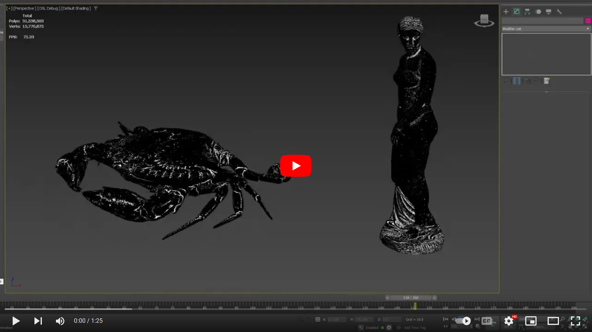

# Organic Noise
This shader filters and modulates a Simplex noise to generate new organicy looking noises. There are many knobs and dials, so you should be able to tweak to your heart's content.

Fundamentally, the algorithm uses the noise gradient, its magnitude and direction to morph the simplex in various ways. This seemed like a neat thing to do.

<!--  -->

### Possible Noises
A collection of noise maps generated using the shader.

## Known Issues
- So far there aren't any, but since the shader must sample Simplex many times, I guess it may be a bit slow in some circumstances. TBD.
- Zap I need Dx and Dy in Arnold pleaaaase.
